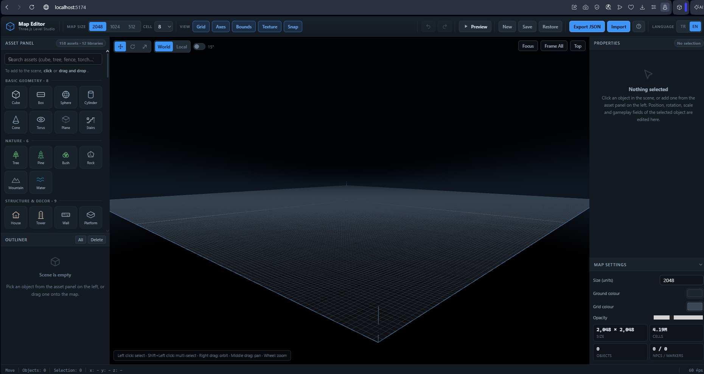
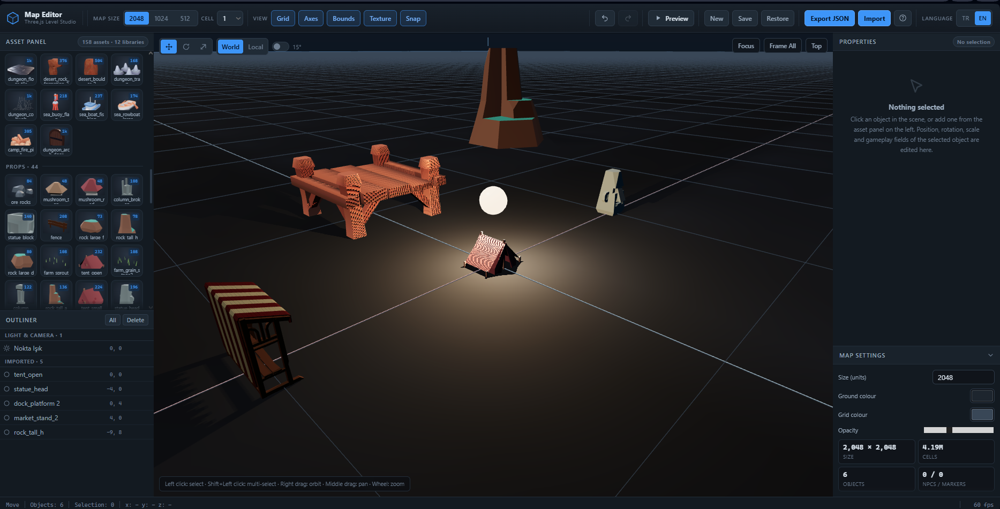
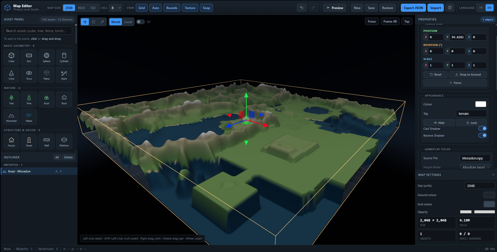
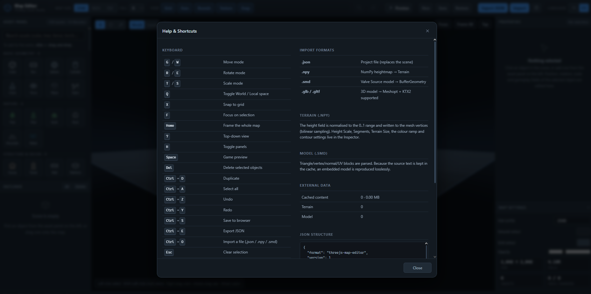

# Three.js 3D Map Editor (Level Studio)
A modern 3D level editor for web games, written with **Three.js** and structured
as **Vanilla JavaScript / ES6 modules**.

* **Dynamic map size** of 2048 / 1024 / 512 units
* **Asset Panel** on the left (add by click or drag-and-drop)
* **Inspector** on the right: position / rotation / scale + gameplay fields
* **TransformControls** for move, rotate and scale (multi-selection pivot supported)
* **JSON import/export**, automatic browser storage
* **Undo / redo**, keyboard shortcuts, outliner
* **Preview (play) mode**: NPCs patrol between waypoints
* **Grid at 2048/1024/512 scale**, procedural ground texture, border frame

## 📸 Screenshots

A few views of the editor UI, asset management and example maps:

### 🖥️ Main editor view


### 📦 Asset management


### 🗺️ Map and level design


### ❓ Help and reference menu

=======
* 2048 / 1024 / 512 birimlik **dinamik harita boyutu**
* Sol panelde **Asset Paneli** (tıkla veya sürükle-bırak ile ekleme)
* Sağ panelde **Özellik Paneli (Inspector)**: konum / rotasyon / ölçek + oyun alanları
* **TransformControls** ile taşıma, döndürme, ölçekleme (çoklu seçim pivotu destekli)
* **JSON dışa/içe aktarma**, tarayıcıya otomatik kayıt
* **Geri al / İleri al** (undo-redo), klavye kısayolları, sahne ağacı
* **Önizleme (play) modu**: NPC'ler waypoint'ler arasında devriye yapar
* **2048/1024/512 ölçekli grid**, prosedürel zemin dokusu, sınır çerçevesi
## 📸 Ekran Görüntüleri (Screenshots)
>>>>>>> 6080c23a588164028d88951e53e4827e2c351b87

Editör arayüzünden, varlık yönetiminden ve örnek haritalardan bazı görünümler:

### 🖥️ Ana Düzenleyici Görünümü


### 📦 Varlık (Asset) Yönetimi


### 🗺️ Harita ve Seviye Tasarımı


### ❓ Yardım ve Kılavuz Menüsü

---

## 1. Running it

ES6 modules cannot be loaded over `file://`, so an HTTP server is required.

```bash
# Option A (recommended) - no-cache dev server, port 5174
python dev_server.py

# Option B - Node (via npx, nothing to install)
npx serve . -l 5173

# Option C - Python (standard library)
python -m http.server 5173

# Option D - VS Code
# Open index.html with the "Live Server" extension
```

Then open <http://localhost:5174> in your browser.

> **Why `dev_server.py`?** Browsers cache ES6 modules aggressively, so a stale
> file may still be served after you edit the source. `dev_server.py` adds
> `Cache-Control: no-store` to every response, so each reload loads current code.
>
> The server is **multi-threaded** with a large connection backlog
> (`request_queue_size = 256`). Neither is decoration: on page load the browser
> opens parallel connections and the Asset Panel fires ~355 thumbnail requests
> at once. Python's default single-threaded server with a 5-connection backlog
> produces `ERR_CONNECTION_REFUSED` under this load — and part of the
> application simply never loads.

> `three` and `three/addons` are loaded from a CDN (unpkg); `node_modules` is not
> required. For offline use, repoint the importmap in `index.html` at local copies.

---

## 2. File structure

```
threejs-map/
├─ index.html                 # Layout (topbar / left panel / viewport / right panel)
├─ dev_server.py              # No-cache development server
├─ package.json
├─ css/
│  └─ style.css               # Design tokens + all interface styles
├─ testdata/                  # Regression test data (.npy / .smd samples)
└─ js/
   ├─ main.js                 # Entry point, language setup, WebGL check
   ├─ scene/
   │  ├─ Viewport.js          # Renderer, camera, OrbitControls, light, sky, fog, FPS
   │  ├─ GridSystem.js        # Dynamic ground + GridHelper + border + axes
   │  ├─ SelectionManager.js  # Raycast, hover, selection boxes
   │  └─ TransformTool.js     # TransformControls wrapper (multi-selection pivot)
   ├─ core/
   │  ├─ EventBus.js          # Pub-sub infrastructure
   │  ├─ Store.js             # Single source of truth: map + object records + selection
   │  ├─ ObjectRegistry.js    # id -> Object3D mapping (O(1) raycast resolution)
   │  └─ I18nManager.js       # Active language, t(key), DOM sweep, localStorage
   ├─ i18n/
   │  ├─ tr.js                # Turkish dictionary (SOURCE + fallback language)
   │  ├─ en.js                # English dictionary
   │  ├─ index.js             # Language registry, browser-language detection
   │  └─ format.js            # Locale-aware number / percentage formatting
   ├─ assets/
   │  ├─ catalog.js           # Asset metadata (name, icon, props schema, footprint)
   │  └─ AssetFactory.js      # Builds Object3D trees from asset codes
   ├─ editor/
   │  ├─ Editor.js            # Orchestrator: wires every module together
   │  ├─ History.js           # Snapshot-based undo/redo
   │  ├─ Topbar.js            # Top bar
   │  ├─ AssetPanel.js        # Top left: asset grid + search
   │  ├─ Outliner.js          # Bottom left: scene tree
   │  ├─ Inspector.js         # Right: properties panel (scrubbable number fields)
   │  └─ StatusBar.js         # Bottom: status bar + statistics
   ├─ io/
   │  ├─ ProjectIO.js         # JSON import/export, validation, localStorage
   │  ├─ NPYParser.js         # .npy binary heightmap parser (pure JS, no three.js)
   │  ├─ SMDParser.js         # Valve .smd ASCII model parser -> BufferGeometry
   │  ├─ BinaryGridParser.js  # [uint32 N][N×N float32] binary grid (HEURISTIC)
   │  ├─ TerrainSystem.js     # Heightmap -> terrain mesh (vertex displacement)
   │  ├─ ExternalAssets.js    # Heavy binary store, OUTSIDE the Store
   │  └─ ImportRouter.js      # Content-sniffed parser routing
   ├─ game/
   │  └─ NPCSystem.js         # Simple patrol simulation in preview mode
   ├─ utils/
   │  ├─ dom.js               # el(), icons, toast, modal, drag-and-drop
   │  └─ math.js              # clamp, snap, format, transform helpers
   ├─ tools/                 # Node scripts (build-time work)
   │  ├─ scan-assets.mjs      # Scans an external project -> copies -> writes manifest
   │  ├─ fetch-transcoder.mjs # Downloads the KTX2 transcoder (matched to three.js)
   │  ├─ generate-thumbs.mjs  # Renders a 128×128 PNG thumbnail per model
   │  ├─ thumbnail-harness.html # Puppeteer's render page
   │  ├─ test-terrain.js      # In-browser regression suite (98 tests)
   │  │                       #   await import('/tools/test-terrain.js')
   │  │                       #   -> runTerrainSuite()
   │  ├─ test-i18n.js         # In-browser i18n suite (65 tests)
   │  │                       #   await import('/tools/test-i18n.js')
   │  │                       #   -> runI18nSuite()
   │  ├─ test-modal-fit.js    # Node/Puppeteer: modal fit + scroll + sticky headers
   │  │                       #   across 7 viewport sizes
   │  ├─ test-all.mjs         # Runs the two browser suites on a cold page,
   │  │                       #   one command, CI friendly
   │  ├─ viewport-harness.html  # iframe host for test-modal-fit.js
   │  ├─ shot-modal.js        # Captures a PNG of the modal
   │  └─ shot-i18n.js         # TR/EN screenshots (by clicking the buttons)
   │                           #   (developer tool; not a test)
   └─ public/                # Static assets (served by the dev server)
      ├─ assets/imported/     # Scanned models + imported-assets.json
      ├─ assets/thumbs/       # generate-thumbs output (PNG)
      └─ vendor/basis/        # KTX2 transcoder (.wasm + .js)
```

---

## 3. Architecture: Store ⇄ Scene

The editor's most important decision: **persistent data lives in the `Store`,
not in the scene object.** `Object3D` is only a view of that data.

```
user change
        │
        ▼
Store.patchRecord(id, patch)  ──►  OBJECT_UPDATE event
        │                                    │
        │                                    ├─► Inspector  (refresh values)
        │                                    ├─► Outliner   (refresh the row)
        │                                    └─► Editor._syncRecordToObject()
        │                                             │
        │                                             ▼
        │                                     Object3D (position/rotation/scale)
        ▼
Export JSON  /  History snapshot
```

What this buys:

| Concern | Result |
|---|---|
| JSON export | The scene is never traversed; `store.objects` is written directly |
| Undo/redo | A JSON text snapshot; the scene is rebuilt |
| Multi-selection | Every record is independent; bulk updates live in one place |
| Inspector | Writes data without touching the scene object |

> **Gizmo exception:** because `TransformControls` moves the object directly, the
> record is updated in the `objectChange` event by *reading from the scene object*
> (`source: 'gizmo'`); in that case nothing is written back (that would loop forever).

---

## 4. Map size

Calling `Store.setMap({ size })` automatically:

1. `GridSystem.setSize()` → rebuilds the ground plane, `GridHelper` (2048/1024/512) and the border
2. `Viewport.frameMap()` → adjusts the camera border, shadow camera and fog distances
3. `TransformTool.setSnap()` → updates the snap step to the new cell size
4. Refreshes the size buttons and the statistics

When the size changes, three options are offered for the existing layout:

| Option | Behaviour |
|---|---|
| **Keep layout** | Objects stay at the same coordinates |
| **Scale** | Position and scale are multiplied by `new/old` |
| **Clear** | The scene is emptied |

---

## 5. Keyboard shortcuts

| Key | Action |
|---|---|
| `G` / `W` | Move mode |
| `R` / `E` | Rotate mode |
| `T` / `S` | Scale mode |
| `Q` | Toggle World ↔ Local space |
| `X` | Snap to grid |
| `A` / `B` | Axes / border frame |
| `H` | Toggle panels |
| `F` | Focus selection |
| `Home` | Frame the whole map |
| `7` | Top-down view |
| `Space` | Game preview |
| `Del` | Delete selection |
| `Ctrl+D` | Duplicate |
| `Ctrl+A` | Select all |
| `Ctrl+Z` / `Ctrl+Y` | Undo / redo |
| `Ctrl+S` | Save to browser storage |
| `Ctrl+E` | Export JSON |
| `Ctrl+O` | Import JSON |
| `Esc` | Clear selection |
| `/` | Search assets |
| `?` | Help window |

**Mouse:** left click select · `Shift`+left click multi-select · right drag orbit ·
middle drag pan · wheel zoom.
In the Inspector you can **grab a number field's label (X/Y/Z) and drag** to
scrub the value (`Shift` = ×10, `Ctrl` = ×0.1).

---

## 6. JSON file format

```json
{
  "format": "threejs-map-editor",
  "version": 1,
  "createdAt": "2026-09-27T10:15:00.000Z",
  "app": { "name": "Three.js Map Editor", "units": "unit" },
  "map": {
    "size": 2048,
    "cellSize": 8,
    "showGrid": true,
    "showAxes": true,
    "showBounds": true,
    "showChecker": true,
    "snap": true,
    "groundColor": "#1b212b",
    "gridColor": "#2b3648",
    "fog": 0.35
  },
  "objects": [
    {
      "id": "obj_m1x2y3z",
      "name": "Tree",
      "assetId": "tree",
      "category": "nature",
      "position": [12.5, 0, -40],
      "rotation": [0, 90, 0],
      "scale": [1, 1, 1],
      "visible": true,
      "locked": false,
      "color": "#4a9d5a",
      "castShadow": true,
      "receiveShadow": true,
      "tag": "forest",
      "props": {}
    },
    {
      "id": "obj_a1b2c3d4",
      "name": "Vezir",
      "assetId": "npc",
      "category": "game",
      "position": [0, 0, 10],
      "rotation": [0, 45, 0],
      "scale": [1, 1, 1],
      "visible": true,
      "locked": false,
      "color": "#5ec8ff",
      "castShadow": true,
      "receiveShadow": true,
      "tag": "patrol",
      "props": {
        "npcName": "Vezir",
        "role": "neutral",
        "speed": 3,
        "health": 100,
        "patrolRadius": 25,
        "autoPatrol": true,
        "loopPatrol": true
      }
    }
  ]
}
```

**Contract rules**

* `rotation` is in **degrees** (readable in a game engine); on import it is
  normalised to `0..360`.
* An unknown `assetId` silently skips the object and raises a warning.
* `position` / `rotation` / `scale` arrays must have 3 elements.
* Missing fields (visibility, colour, shadow flags, props) are filled in on import.
* `map.size` only accepts 2048 / 1024 / 512; other values are rounded to the
  nearest valid one and a warning is produced.

### Handing off to a game engine (example)

```js
// You can consume the exported JSON directly in the browser.
const map = await fetch('/maps/map_2048.json').then(r => r.json());

// Or place it in your scene directly, with three.js loaded:
for (const o of map.objects) {
  const mesh = buildMeshFor(o.assetId);          // your own asset factory
  mesh.position.fromArray(o.position);
  mesh.rotation.set(...o.rotation.map(THREE.MathUtils.degToRad), 'YXZ');
  mesh.scale.fromArray(o.scale);
  scene.add(mesh);
  if (o.assetId === 'npc') agents.push({ mesh, props: o.props });
}
```

---

## 6-bis. File import: `.npy`, `.smd` and binary grids

The `Import` button (or dropping a file onto the viewport) inspects the file
**by its content first**, then routes it to the correct parser.

| Extension | Content check | Parser | Result |
|---|---|---|---|
| `.json` | — | `ProjectIO` | Scene is replaced (project loaded) |
| `.npy` | — | `NPYParser` + `TerrainSystem` | **Terrain** object |
| `.smd` | `ascii-smd`? | `SMDParser` | **Imported Mesh** |
| `.smd` | `binary-grid`? | `BinaryGridParser` | **Terrain** (heuristic) + warning |
| `.bin .raw .grid .map .dat` | always | one of the above | decided by content |

Multiple files can be dropped at once. `.json` files are processed **last**;
otherwise loading a project would delete the objects added before it. For
unsupported extensions (`.npz`, `.obj`, `.fbx`, `.vmdl` …) the user gets a
clear error listing the accepted formats.

> ### ⚠️ Why content sniffing?
>
> In the wild, some files named `.smd` are **not Valve ASCII SMD**. Third-party
> tools also use this extension for binary map dumps. Feeding those to a text
> parser produces a meaningless error like *"Line 1: expected 'version', found
> '<binary>'"* and sends the user hunting for hours.
>
> So `.smd` and ambiguous extensions are checked by their first bytes: if the
> first line is `version N` it is ASCII SMD; if the file starts with
> `[uint32 N][N×N float32]` it is a binary grid; if neither, you get an error
> that **says what it found**.

### `.npy` — NumPy heightmap

`NPYParser.js` is completely standalone (imports no three.js, also runs in a Web
Worker) and handles:

* the magic array (`0x93NUMPY`), versions 1/2/3, header length (v1: uint16, v2/3: uint32)
* the Python dict literal in the header — **`eval()` is not used**; a small
  recursive parser handles it instead (security: file content is untrusted input)
* `descr` dtype → `bool |b1`, `int8/16/32/64`, `uint8/16/32/64`, `float16/32/64`
  (manual IEEE-754 half → float32 conversion for float16)
* byte order: `<` little, `>` big-endian, `|` not applicable
* `fortran_order` → the matrix is transposed into C order
* multi-dimensional arrays: 1D → 1×N, 3D → channel selection or channel average
* validation: bad signature, short/truncated data, oversized arrays, NaN/Inf counting

`TerrainSystem` applies the heightmap to the terrain:

1. `PlaneGeometry(size, size, segments, segments)` → `rotateX(-90°)`
2. for each vertex, a **bilinear sample** is taken from the heightmap → the
   heightmap resolution and the mesh segment count are independent (a classic
   257×257 Source heightmap fits a 512-segment terrain without a warning)
3. converted to world Y via `projectHeight()` (see *Height Mode* below)
4. normals are recomputed, vertex colours are painted by height

```python
# anything saved with numpy loads directly
np.save("map.npy", heightmap.astype(np.float32))       # (257, 257)
```

### Height Mode — absolute or normalized?

This is the **most important** setting; choosing wrongly loses data silently.

| Mode | Formula | When |
|---|---|---|
| **Absolute** (default) | `y = (v − heightBase) × heightScale` | Raw `.npy` values are **world units** |
| **Normalized** | `y = (v−min)/(max−min) × heightScale` | Raw data uses an arbitrary range (0–255 LUT etc.) |

> Knight Online / Source style maps usually have heightmaps that are **absolute
> world heights** — they contain negative valleys. Loading such data with
> `normalize` squeezes the `min…max` range into `0…heightScale`, so both the
> negative valleys and the absolute heights are lost. That is why the default is
> **absolute** with `heightScale = 1` and `heightBase = 0`: the heightmap becomes
> the world height verbatim.

Example — a real map spanning `−34.74 … 51.12`:

| Setting | Result |
|---|---|
| Absolute, scale 1, base 0 | `−34.63 … 50.94` ✅ valleys and heights preserved |
| Normalize, scale 40 | `0 … 40` ⚠️ information compressed away |
| Absolute, scale 2 | `−69.3 … 101.9` ✅ the requested range |

The **reference plane (`heightBase`)** moves the lowest point to 0: with
`heightBase = −34.74` the terrain spans `0 … 85.9`.

### Water and shore tinting

If the `Water Level` field is left empty, **automatic** mode applies: `0` (sea
level) if the raw data contains negative values, otherwise the lowest point. Real
world heightmaps therefore show valleys as water naturally, while entirely
positive data (a 0–255 LUT) never gets water painted on it needlessly.

* `y ≤ water` → **Water Colour**
* `y ≤ water + Shore Band` → **Shore / Sand Colour** (the band is in world units; keep it thin)
* above → Low → Mid → High → Peak ramp

### Performance: how expensive is each change?

`TerrainSystem` keeps a snapshot of the last applied props and computes the
**real difference** (`Store.patchRecord` sends the entire props object, so
"which field changed" cannot be recovered from the event). For 257 segments
(66k vertices):

| Change | Path | Cost |
|---|---|---|
| `heightScale` | `rescaleGeometry` — `y *= new/old` | very fast |
| `heightMode`, `heightBase` | `reprojectGeometry` — recompute Y from `aHeight` | fast |
| Colours, water level, shore band | `colorizeTerrain` — only `color` | fast |
| Wireframe, flat shading | material flag | instant |
| `segments`, `terrainSize`, `flipRows` | `rebuild` — resample | expensive |

All requests are coalesced into one frame (`rAF`), so scrubbing a label performs
only one unit of work per frame.

**Scale is preserved on rebuild:** `displaceGeometry` reads the height projection
from `opts.props.heightScale`. Reading `opts.heightScale` always yields
`undefined` and would silently drop the scale to 1 — a bug visible *only* when
`heightScale ≠ 1`. `tools/test-terrain.js` tests this explicitly.

### `.smd` — Valve Source model

`SMDParser.js` reads the blocks line by line, in this order:

```
version 1
<triangleCount>
<3 × (vertexIndex  px py pz  nx ny nz  u v)>   ← 27 numbers (canonical Valve format)
<vertexCount>  <px py pz>
<normalCount>  <nx ny nz>
<texcoordCount><u v>
<skinWeightCount> / <boneWeightCount>         ← optional
<groupCount>  {  <id> <name>  }
```

> **Both the vertex-indexed (27 numbers) and the non-indexed (24 numbers) forms
> are supported.** In the latter, indices are derived as `triangleIndex*3 + corner`
> and the file is only considered consistent when
> `numVertices === numTriangles × 3` (a warning is raised otherwise).

* `//` comments, blank lines, CRLF, UTF-8 BOM, a missing `version` line
* optional skin/bone blocks are identified with **lookahead validation**
  (if the number is 0 and a `{` follows, it is the group count)
* a missing group block produces a warning rather than an error
* `mode: 'auto'` → **indexed** (shared vertices) geometry when `numVertices > 0`,
  otherwise `flat` (3 vertices per triangle, normals/UVs unambiguously correct)
* `convert: 'source'` → Source (Z-up, left-handed) → three.js (Y-up, right-handed):
  `x' = -y,  y' = z,  z' = x` (determinant +1 → triangle winding preserved)
* `skinIndex` / `skinWeight` attributes are produced when bone weights exist
* the source text is stored in `ExternalAssetCache` → when embedded in JSON and
  reloaded, the model is **reproduced losslessly**

### Binary grid (`.smd` / `.bin` / `.map` / …) — **heuristic**

`BinaryGridParser.js` reads this layout:

```
[uint32 N]  [N × N float32]  …(remaining bytes are ignored)
```

This is **not a complete format implementation** and does not pretend to be. It
only reads the grid at the start of the file, validates it (is `N` plausible, are
the values finite and plausible, are they all identical?) and tells the user
**explicitly what was read and what was skipped**. When it cannot be sure it
raises an error; it never invents geometry.

> A real example: the first 257×257 float block of a 3 MB `.smd` file coming
> from Knight Online map tools had **exactly the same min/max values** as that
> same map's `.npy` heightmap (`−34.739 … 51.115`), and was loaded as terrain.
> The remaining 2.7 MB of the file was not processed by this reader — the console
> output says so plainly.

### Heavy data: the out-of-Store cache

Imported content does not fit in JSON (2048² float32 ≈ 16 MB, base64 ≈ 22 MB).
Heavy data therefore lives in `ExternalAssetCache` as `id → data`; the Store
record holds only **metadata + a 64×64 preview**.

| Mode | JSON content | Round-trip |
|---|---|---|
| `includeExternalData: false` (default) | terrain: metadata + 64×64 preview · mesh: **source text** | meshes lossless, terrain low resolution (`degraded`) |
| `includeExternalData: true` | terrain: base64 float32 (lossless) · mesh: source text | fully lossless |

The `Export JSON` button asks which mode to use when there is content to
export. Automatic save (localStorage) always uses the lightweight mode.

**Undo preserves terrain data:** when an object is deleted its cache entry is not
removed immediately; `ExternalAssetCache.gc()` cleans it once the undo window has
passed (`missCount > 64`). Otherwise undoing would return a flat plane.

### Test data and regression tests

`testdata/` contains real NumPy and SMD samples:

```
.npy : height_257_f32/f64/f16, height_int16, height_u8, rgb_3d, fortran,
       bigendian, mask_bool, nan_inf, scalar, empty, complex (must be rejected)
.smd : plane, cube, baked (non-indexed), flipped, boned, crlf_bom, empty,
       bad_group, truncated, nan, bad_index (all must be rejected)
user/ : real-world files (Moradon.npy, moradon.smd, …) — optional
```

**The suite runs in the browser** — from the console:

```js
const T = await import('/tools/test-terrain.js');
await T.runTerrainSuite();          // writes to the console, 98 tests
const r = await T.runTerrainSuite({ verbose: false });
console.log(r.pass.length, r.fail); // get the details programmatically
```

Coverage: height modes, scale preservation on rebuild, undo/redo,
`sampleWorld` ↔ mesh consistency, water/shore, file routing (ASCII SMD, broken
SMD, `.npy`, binary grid, misleading extension, noise file), JSON round-trip,
Inspector field bindings for every asset type, and thumbnail behaviour
(lazy-load, 404 → fallback, `draggable=false`).

> The suite is **idempotent**: `sifirla()` clears all module state and
> `waitFor()` waits on a condition instead of a fixed delay. A fixed `wait()` is
> not enough because terrain prop updates are coalesced in `rAF`
> (`_flushTerrainSync`). If you run the suite immediately in a freshly opened
> tab, the page bootstrap (automatic save restore) can race with the test's own
> setup — wait until `e._firstLoad` has resolved.

**Node/Puppeteer test — modal fit** (no browser tab required):

```bash
python dev_server.py 5174      # must be running in a separate terminal
node tools/test-modal-fit.js
```

It measures 7 viewport sizes (1600×1000 → 1440×380): does the modal exceed 85vh,
do the header and footer stay pinned while scrolling, does the body scroll on
its own, are the section headers sticky, does the column count drop on narrow
screens, is `Escape` closing still intact. **98 measurements, all passing.**
Because the window size cannot be changed in headless Chrome, the editor is
placed in an iframe in `tools/viewport-harness.html` — the iframe's own viewport
is the size under test.

To regenerate the test data:

```python
import numpy as np
h = (np.sin(np.linspace(0, 12, 257))[:, None]
     * np.cos(np.linspace(0, 9, 257))[None, None] * 180 + 260).astype(np.float32)
np.save("testdata/height_257_f32.npy", h)
```

---

## 6-ter. EXTERNAL 3D ASSET LIBRARY

Imports `.glb` / `.gltf` / `.obj` models from another project into the editor.
The process has two stages:

```
┌─ BUILD TIME (Node) ─────────────────────┐   ┌─ RUNTIME (Browser) ───────────────────────┐
│ tools/scan-assets.mjs                   │   │ js/io/ImportedAssetLibrary.js             │
│  → scan, copy, build manifest           │──▶│  → read manifest                         │
│ public/assets/imported/imported-assets. │   │  → lazy load (GLTFLoader)                 │
│ json + <category>/<name>.glb            │   │  → LRU cache                              │
└──────────────────────────────────────────┘   │  → AssetPanel category                   │
                                                └─────────────────────────────────────────┘
```

> ### ⚠️ Why two stages?
>
> The editor is a static application running in the browser; it cannot access
> the file system. It cannot enumerate the 1390 models under
> "C:\...\public\models". Scanning + copying + manifest generation is therefore
> a **build-time** task; the editor only reads the generated
> `imported-assets.json`.

### Setup

```bash
# 1) scan the models, copy them and build the manifest
node tools/scan-assets.mjs

# 2) download the transcoder for KTX2 textures (matched to the three.js version)
node tools/fetch-transcoder.mjs

# 3) start the editor
python dev_server.py 5174      # → http://localhost:5174
```

The `World of Claudecraft` categories then appear in the asset panel
automatically.

### Script options

| Option | Meaning |
|---|---|
| `--src <path>` | Source root (default: `C:\worldofclaudecraft\world-of-claudecraft-main`) |
| `--out <path>` | Output folder (default: `public/assets/imported`) |
| `--limit <n>` | At most n models. Sorted small to large, so **the most models fit in the least space** |
| `--min-kb <n>` / `--max-mb <n>` | Size filters (default: `< 8 MB`) |
| `--include "a,b"` | Only scan these source folders |
| `--exclude "a,b"` | Skip these folders (default: `test, node_modules, dist, …`) |
| `--category-depth n` | How many folder levels deep the category name comes from (1 = direct children) |
| `--no-gltf` / `--no-obj` | Disable specific formats |
| `--clean` | Empty the output folder first |
| `--dry-run` | Produce a report **without copying** |
| `-v` | Write a line per file |

Examples:

```bash
# only dungeons and props, at most 200 models
node tools/scan-assets.mjs --include "dungeon,props" --limit 200

# see what would happen first
node tools/scan-assets.mjs --include dungeon --limit 200 --dry-run
```

### Compression: Meshopt and KTX2

**1249 models in the scanned library use `EXT_meshopt_compression`** and
**1191 use `KHR_texture_basisu`**, both declared in `extensionsRequired`. Without
these two extensions most models **cannot be loaded**:

| Extension | What it does | Decoder |
|---|---|---|
| `EXT_meshopt_compression` | Compresses vertex buffers | `MeshoptDecoder` |
| `KHR_texture_basisu` | Compresses textures as Basis/KTX2 | `KTX2Loader` + transcoder |

`fetch-transcoder.mjs` downloads the transcoder **matched to the exact three.js
version** and verifies that the `.wasm` really is WebAssembly. Vendoring it
rather than pulling it from a CDN at runtime is deliberate: a version mismatch
silently produces corrupt textures and does not work offline.

> The source project's own loader makes exactly the same two calls
> (`src/render/assets/loader.ts`), so this setup behaves identically to theirs.

### Memory: 1390 models, 24 in memory

Models are loaded **lazily** — only what is in the scene is fetched. Loaded
models are held in an LRU cache and **geometry/material instances are shared
across clones**:

```
200 trees  →  1 file downloaded, 1 geometry, 1 material, 200 nodes
```

Because `clone()` also clones materials, `instantiate()` explicitly undoes that
(`object.getObjectByName`). This is a deliberate trade-off: loading a separate
texture per copy would mean 200 × the texture memory.

### Scale: models look small on this map

The library models were authored at **yard/metre scale** (measured median ~1.2
units: a shield 0.88, a column 1.5×4×1.5). On this map 1 unit is one grid cell
(default 8), so the models appear small.

That is why the Inspector has a **Target Height** field:

| Setting | Result |
|---|---|
| `0` (default) | 1:1 — nothing changes |
| `3` | the model is scaled to 3 units tall, `scale` is written to the record |

Scaling silently was **deliberately not chosen**: in projects that place
scale-sensitive content (enemy hitboxes, door gaps), changing the scale without
being asked produces a "why is my model 3× too big?" bug.

> **The `KHR_mesh_quantization` trap:** when that extension is used, accessor
> `min/max` values are **in quantized space**, not world units — you typically
> get nonsense numbers like `65534`. The browser marks `sinirGuvenilir: false`
> in the manifest, and the editor measures the real bounds **after** the model
> is loaded.

### Error and path handling

| Situation | Behaviour |
|---|---|
| **Name collision** | `fence.glb` → `fence_2.glb` in the output folder. The source project is **not modified**; the original path is kept in the manifest's `kaynak` field |
| **Broken GLB** | Magic number / version / chunk size are validated; if invalid the file goes to `sorunlar.atlanan` and is not copied |
| **Missing directory** | `✗ Source directory not found` + a `--src` hint, exit code 1 |
| **Missing KTX2 transcoder** | The manifest is still produced; only KTX2-textured models fail to load and this is **explicitly** reported |
| **No manifest** | The editor **works normally**, the category stays empty, one informational line is logged |
| **Dropped local file** | Carried in the project JSON as `imp:serbest_*` but has no counterpart on the server. It cannot be resolved in a new session; the record is **not lost**, it stays with a "drag it again" note |
| **Page reload** | `_bootstrap()` runs **after** the library manifest has loaded; otherwise it would fail while trying to resolve saved models |

### Single file drag-and-drop

Dropping a `.glb` / `.gltf` / `.obj` straight onto the viewport works too. These
files are not copied to the server and are only valid for that session; models
from the library are persisted via `imported-assets.json`.

```js
const T = await import('/tools/test-terrain.js');
await T.runTerrainSuite();   // 98 tests: terrain + external library + thumbnails
```

**To run every browser suite with a single command:**

```bash
python dev_server.py 5174      # must be running in a separate terminal
node tools/test-all.mjs        # 163 tests: terrain (98) + i18n (65)
```

`test-all.mjs` runs each suite on a **cold** page (new tab, empty localStorage).
That is how the "first run is broken" flakiness — previously seen in the terrain
suite and appearing only on a fresh load — gets caught.

---

### Thumbnail (preview) generation

`tools/generate-thumbs.mjs` loads every model in the manifest in an **isolated
scene**, renders a 128×128 PNG and writes the path back into the manifest's
`thumb` field.

```bash
npm install                      # puppeteer (the only dev dependency)
node tools/generate-thumbs.mjs   # or:  npm run thumbs
```

**Why Puppeteer?** The library mandates the `EXT_meshopt_compression` (vertex
buffer) and `KHR_texture_basisu` (Basis/KTX2 texture) extensions. Reimplementing
both decoders in pure Node (meshopt + basis transcoder) would be both enormous
and not byte-identical to three.js's implementation. A real browser engine gives
you three things for free: the full GLTFLoader, real WebGL, and the transcoder's
WebAssembly.

The script starts its **own temporary HTTP server** (port 0 → collisions are
impossible), which eliminates `file://` CORS/WASM problems. The three.js version
is read from the importmap in `index.html`; if it does not match the transcoder,
textures are silently corrupted.

#### Script options

| Option | Meaning |
|---|---|
| `--size <n>` | Frame size (default 128) |
| `--limit <n>` | At most n models |
| `--include "a,b"` | Only these categories |
| `--par <n>` | Concurrent browser pages (default cores−1, max 3) |
| `--azimut <°>` | Camera azimuth (default 35 — a 3/4 view) |
| `--egim <°>` | Camera elevation (default 22) |
| `--doluluk <0-1>` | Frame fill (default 0.82) |
| `--ters-normal` | When the normal map is inverted |
| `--yeniden` | (default) skip thumbnails that are already current |
| `--hepsini` | Regenerate everything |
| `--size 256` | Larger thumbnails for a retina panel |
| `-v` | Per-model output |

```bash
# quick preview: one category, large image
node tools/generate-thumbs.mjs --include dungeon --limit 40 --size 256

# change the camera angle and regenerate everything
node tools/generate-thumbs.mjs --azimut 45 --egim 30 --hepsini
```

#### Render rules

* **Automatic framing** — models vary between 0.15 and 7 units. The camera is
  re-fitted to each model's bounding box, so a gem and a pillar get the same
  share of the frame.
* **Fixed lighting** — three directional lights + fill + ambient. Lighting that
  varied per model would make the 400 thumbnails incomparable.
* **Transparent background** — the PNG has no background; it is legible on both
  the dark and the light panel.
* **Isolation + dispose** — after every model the geometry, material and
  **textures** are released. KTX2 texture decoding is so fast that without
  cleanup Chrome collapses after a few hundred models.

#### Result and error handling

```
produced   : 353        (355 thumbnail files, 2.9 MB, avg. 8.4 KB)
skipped    : 2          (already current)
failed     : 45         → all "no mesh (animation/skeleton data only)"
```

Models that cannot be produced do **not** throw the whole job away; they are
listed under `sorunlar.thumbnail` in the manifest. For the "no mesh" result,
`meshVar: false` is **written back** — so the editor does not mistake these
files for meshed ones and the user does not add an object that looks empty.

#### Display in the panel and performance

`AssetPanel._createThumb()` places one `` per card:

| Attribute | Why |
|---|---|
| `loading="lazy"` | The image is only fetched when it enters the viewport. Even with 400 cards only the ~20 visible ones issue requests. |
| `decoding="async"` | PNG decoding does not block the main thread |
| `width` / `height` | Space is reserved before the image loads; prevents hundreds of cards from thrashing layout |
| `draggable="false"` | The card's drag-and-drop behaviour is not broken |

Additionally:

* **Shimmer skeleton** — cards not yet fetched (because of `loading="lazy"`)
  signal "waiting" with a moving gradient rather than a flat grey box. With
  `prefers-reduced-motion` enabled the animation stops.
* **Fallback** — if no thumbnail was produced (broken model, meshless file) or
  the file returns 404, it falls back to the cube icon. The `error` listener is
  bound with `once` and the broken `` is removed from the DOM.
* **`content-visibility: auto`** — a card's contents are **not painted** before
  it scrolls into view; `contain-intrinsic-size` prevents the scrollbar from
  jumping.

Measured: 89 cards in the DOM, only **21** images fetched (the ones in view),
zero broken images.

---

## 6-quater. MULTI-LANGUAGE INTERFACE (i18n)

The editor switches between Turkish and English. The language is changed with the
**TR ⇄ EN** button at the right end of the top bar, is stored in `localStorage`
and is restored on the next page load.

### Why the language is not in the `Store`

`Store` holds the state of the **map** and is written to JSON by `ProjectIO`.
The interface language is a user **preference**, not project data: telling
someone reading a map in English that "it opened in the Turkish view" would be
wrong. The language therefore lives in its own source (`I18nManager`) and does
**not** enter the JSON.

Unlike map settings — grid colour, cell size, ground colour — those are part of
the project and stay in the `Store`.

### Files

```
js/i18n/tr.js               Turkish dictionary — SOURCE and fallback language
js/i18n/en.js               English dictionary
js/i18n/index.js            Language registry, browser-language detection
js/i18n/format.js           n() / pct() — locale-aware number formatting
js/core/I18nManager.js      Active language, t(key), DOM sweep, localStorage
```

### Resolution order

```js
i18n.t('status.objects', { count: 1234 })
```

1. active language · `status.objects.one`    (only when `count` is given)
2. active language · `status.objects.other`
3. active language · `status.objects`         → plural / default form
4. **fallback language** (Turkish) · the same three attempts
5. the key itself + a console warning

A key that is not found **does not return empty** — it returns the key itself and
emits a `MISSING` event. An empty string makes "the UI is broken" and "the
translation is missing" indistinguishable; a box reading `topbar.btn.export`
reports its own problem.

### Plural forms

**Turkish has no plural suffix** — "1 nesne" and "5 nesne" are written
identically. So the TR dictionary does not need `.one` and does not define it.
English pluralises the noun, so it uses `.one` plus the plain key (plural):

```js
// tr.js  — one form is enough
'status.objects': 'Nesne: {count}',

// en.js  — singular + plural
'status.objects.one':   'Object: {count}',
'status.objects':       'Objects: {count}',
```

`tools/test-i18n.js` enforces this rule: if an English key has a noun ending in
`s` immediately after `{count}`, `.one` **must** exist — otherwise it would
produce a grammar error like "1 objects".

### When adding new text

1. Let the key carry the **meaning**, not the wording: `btn.save` = "Save". If a
   translation is updated, the code does not change.
2. Add it to **both** dictionaries. A missing plain key falls back to the other
   language and the user sees a mixed-language UI — the test catches this.
3. If it contains a number, think about whether `.one` is needed.
4. `data-i18n` only goes on elements with **no child nodes**. Otherwise writing
   `textContent` would delete the icons/labels inside; `I18nManager`
   deliberately skips those and logs a warning.

### Refreshing the DOM: two layers

Changing the language needs two different mechanisms:

| Layer | Scope | How |
|---|---|---|
| **Sweep** | Static text and attributes: `data-i18n` / `data-i18n-attr` in `index.html`, nodes produced by `el()` | `I18nManager.apply()` walks the whole document |
| **Re-render** | Computed text: "Objects: 12", "Category: biome", "3 locked skipped" | The component registers a callback via `i18n.register('inspector', …)` |

Why is a sweep alone not enough? The `12` in "Objects: 12" is not in the DOM, it
is in the `Store`; a sweep cannot regenerate it. Why is a re-render alone not
enough? Attributes like `title` / `placeholder` and button labels must change
without the component being rebuilt; worse, a re-render could wipe the value of
an `<input>` the user currently has focused.

Order matters: sweep first, then re-render. In the opposite order the sweep
cannot see the component's newly created nodes.

### `el()` integration

```js
el('span', { i18n: 'topbar.btn.save' })
el('input', { i18nAttr: { title: 'topbar.btn.load.title' } })
el('span', { i18n: 'status.objects', i18nArgs: { count: 12 } })
```

The produced nodes are marked with `data-i18n` and join the sweep automatically.
This is the cheapest way to get JS-produced text into the translation layer.

### Asset catalogue

The Turkish `name` / `label` fields in `catalog.js` are **source text** and do not
enter the dictionary. The normalisation pass at the end of the file stamps every
record with a key derived from its identity:

```
asset.nameKey      = asset.name.<id>
category.labelKey  = asset.cat.<id>
schema.labelKey    = prop.<assetId>.<schemaKey>
option.labelKey    = propopt.<assetId>.<schemaKey>.<value>
```

The key is qualified by the **asset identity**, not just the field name. In the
Turkish dictionary, `waypoint.radius` is `"Yarıçap"` while `portal.radius` is
`"Aktivasyon Yarıçapı"` (both quoted here verbatim from `tr.js` as evidence).
Deduplicating by field name either collides or shows the wrong text under a
misleading key.

When you add a field the key is generated **automatically**; the only thing that
can be missing is the dictionary entry, and the test reports it.

### Open modal windows

`openModal` builds its body once; it would go stale on a language change. The
solution: `opts.html` may also be given as a **function**, and
`refreshOpenModal()` calls it again. The help window uses this path
(`Editor._helpHtml`), so an open window is translated instantly and the scroll
position is preserved.

### Console / debugging

```js
const { i18n, I18N_EVENT } = await import('/js/core/I18nManager.js');

i18n.on(I18N_EVENT.MISSING, (a) => console.log('missing:', a));
i18n.on(I18N_EVENT.CHANGE, ({ language }) => console.log('language:', language));

i18n.language          // 'tr' | 'en'
i18n.languages         // [{ kod, ad, bayrak }] for the selector
i18n.setLanguage('en') // emits the event + applies the DOM
i18n.toggleLanguage()  // TR ⇄ EN
i18n.exists('btn.save')
```

### Tests

```bash
python dev_server.py 5174
node tools/test-all.mjs        # runs both suites on a cold page (163 tests)
```

Or from the browser console:

```js
const T = await import('/tools/test-i18n.js');
await T.runI18nSuite();       // 65 tests
```

Coverage: dictionary parity across both languages, template/placeholder parity,
plural selection, the fallback chain, resolvability of **every** `data-i18n` key
in the DOM, `el()` integration, catalogue schema labels, re-rendering of
Inspector / Outliner / AssetPanel / StatusBar, localStorage persistence,
tolerance of a corrupt stored value, rebuilding an open modal, number formatting,
and the "no raw key text left in the DOM" check.

### Adding a new language

1. Create the `js/i18n/<code>.js` dictionary (copy TR, then translate).
2. Add `{ kod, ad, metin }` to the `DILLER` array.
3. Update the parity check in `test-i18n.js`: the new language's **plain** keys
   must have a counterpart in TR.

---

## 7. Asset catalogue

The `ASSETS` array in `js/assets/catalog.js` is the single configuration point:

```js
{
  id: 'npc',                    // the code written to JSON
  name: 'NPC',
  category: 'game',             // panel group
  footprint: [1, 2.1, 1],       // base size shown in the info panel
  color: '#5ec8ff',             // default colour
  role: 'actor',                // prop | actor | marker | zone | light
  icon: '<svg …>',              // panel icon
  propsSchema: [ … ],           // fields generated in the Inspector
  defaultProps: { … }           // values applied to a new object
}
```

To add a new asset:

1. Add the definition to `catalog.js` (with icon and props schema)
2. Add a builder under the same `id` in the `BUILDERS` map in `AssetFactory.js`
   (`nt()` = part insensitive to the colour change, `part()` = sensitive part)

Existing assets: Cube, Box, Sphere, Cylinder, Cone, Torus, Plane, Stairs, Tree,
Pine, Bush, Rock, Mountain, Water, House, Tower, Wall, Platform, Bridge, Crate,
Barrel, Fence, Torch, **NPC**, Player Spawn, NPC Spawn, **Waypoint**, Trigger,
Portal, Pickup, Chest, Barrier, Camera Marker, Point/Spot/Ambient Light.

---

## 8. Game objects (NPC workflow)

1. Add an `NPC` and position it with the gizmo
2. Place `Waypoint` objects along its route (the order number comes from the Inspector)
3. Set the NPC's `Patrol Radius` so it covers the waypoints
4. Press `Space` to start the **preview**; NPCs walk at their `Speed`, turn toward
   +Z and wait `Pause` seconds at each waypoint
5. Leaving the preview **reverts the positions automatically** — experimenting
   loses no data

Because the `props` fields are written straight into JSON, you can feed the same
fields into the patrol logic of your own game engine.

---

## 9. Performance notes

* The ground texture is generated in **greyscale** and tinted via
  `material.color`; changing the ground colour does not regenerate the texture.
* The checker pattern is tiled once as a 2×2 unit `CanvasPattern` (no per-cell
  `fillRect`).
* `GridHelper` colours are written to the `color` attributes without rebuilding
  the geometry (GridHelper's colour layout is deterministic: 4 vertices per line).
* `Object3D` lookups are O(1) via `ObjectRegistry` (no tree traversal).
* The `OBJECT_UPDATE` event only carries the fields that **actually changed**;
  during a gizmo drag, colour/shadow/light are not reapplied.
* The `Outliner` refreshes only the changed row on an object update, not the
  whole list.
* `castShadow` is not assigned to `AmbientLight`/`HemisphereLight` objects; if it
  were, three.js would print a warning on every frame.
* Automatic save is debounced by 2.5 s.
* Measured: 101 objects / ~13k triangles → 60 FPS.

## 10. Known limitations

* Touch editing is not a target (the interface simplifies on narrow screens).
* In multi-selection, scaling works proportionally through the `pivot`; the
  *local* positions of scaled objects are kept relative to the pivot, while
  **world** positions always match the records exactly.
* TransformControls' drag maths belong to three.js; this project only manages
  the gizmo ↔ record bridge (`source: 'gizmo'`).
* There is no collision computation; `trigger`/`portal` zones are stored as
  visuals + data only.
* `BinaryGridParser` is a **heuristic** reader: it only reads the
  `[uint32 N][N×N float32]` block at the start of the file and skips the rest.
  Fully parsing a third-party tool's output requires that tool's format
  specification. The console output states the number of skipped bytes plainly.
* Terrain `Water Level` and `Shore Band` are **visual** tinting only; they do not
  produce real water or a water volume.
* The reference grid is on the `y = 0` plane. In absolute mode the terrain can
  dip below it; if you find the grid visually noisy you can switch it off with
  the `Grid` button in the top bar.

---

## 11. Browser support

Current versions of Chrome / Edge / Firefox / Safari (WebGL2). Touch editing is
not a target; the interface simplifies at the 1180 px and 900 px breakpoints.

---

## License

**MIT** — copyright holder: [ahmtsylk1](https://github.com/ahmtsylk1) · full text: [`LICENSE`](LICENSE)

This repository also **redistributes third-party content**. The MIT licence
requires the copyright notice to be preserved in copies; the relevant notices
are in [`THIRD-PARTY-NOTICES.md`](THIRD-PARTY-NOTICES.md):

| Content | Location | Copyright / Licence |
|---|---|---|
| 400 `.glb` models | `public/assets/imported/` | Copyright (c) 2026 Levy Street — MIT (World of Claudecraft v0.43.3) |
| Basis transcoder (`.wasm` + `.js`) | `public/vendor/basis/` | three.js r160 — MIT |
| Render engine | from CDN (not in the repo) | three.js — MIT |
| Synthetic test data | `testdata/*` | Belongs to this repository (synthetic) |
| ⚠️ Real-world heightmaps | `testdata/user/` | **Provenance unverified** — read the note below before making the repo public |

> **`testdata/user/` warning.** The 7 files in this folder (Moradon, Luferson,
> Elmorad, Ronarkland, Ardream, Eslant — ~6.7 MB) are real-world data and their
> provenance is not documented. The test suite uses this folder but it is **not
> required**; if it is absent the relevant tests are silently skipped and the
> remaining tests pass. Before making the repository public, either verify the
> licence or remove the folder with `git rm -r --cached testdata/user`.
